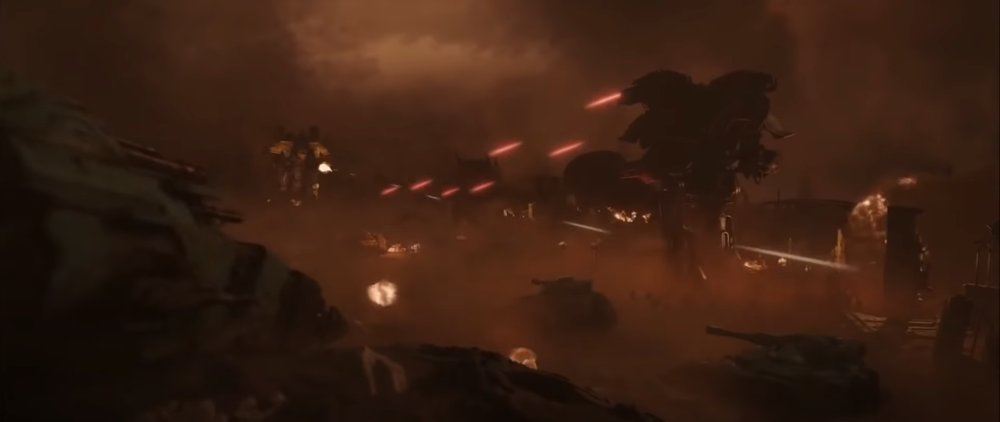
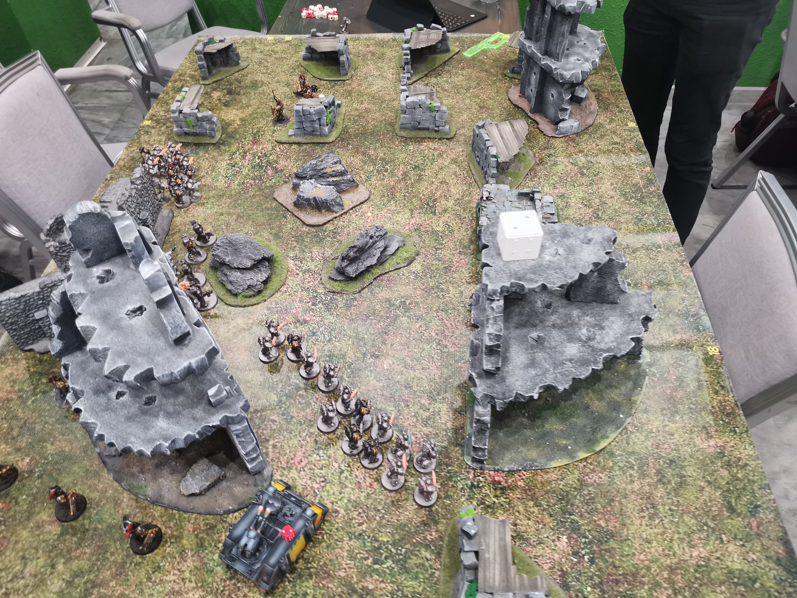
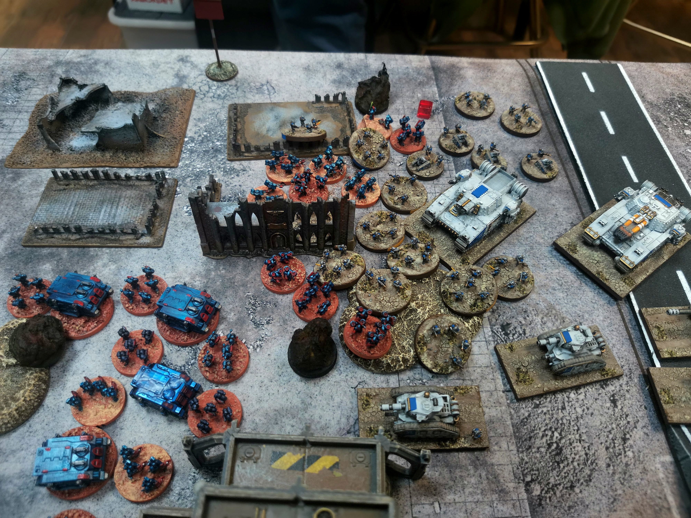
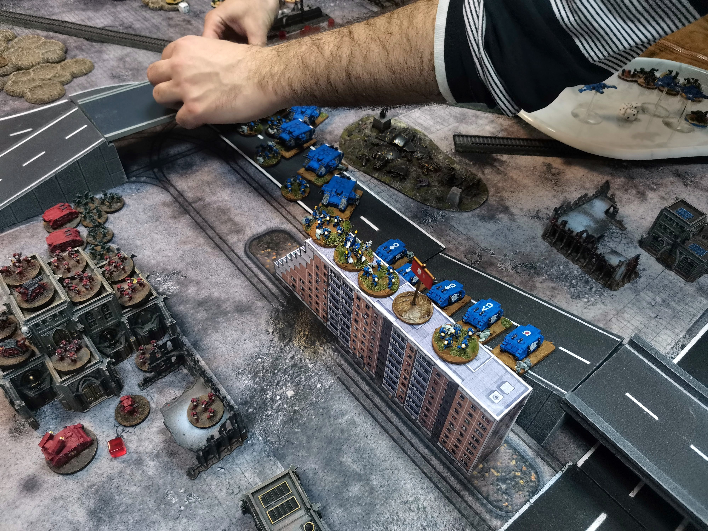
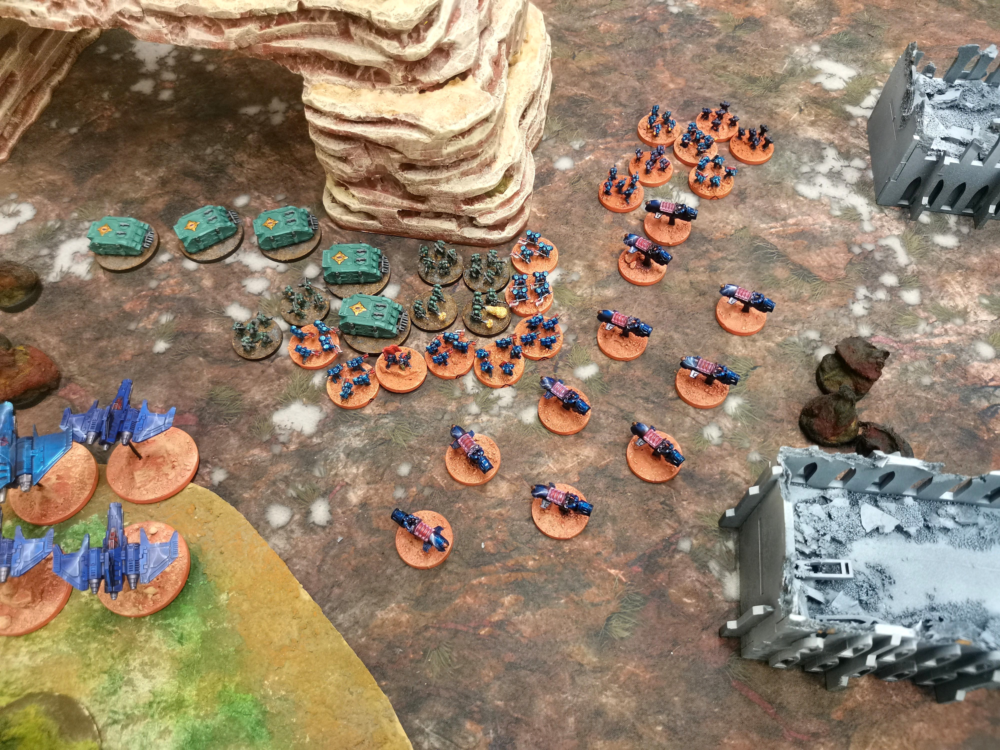
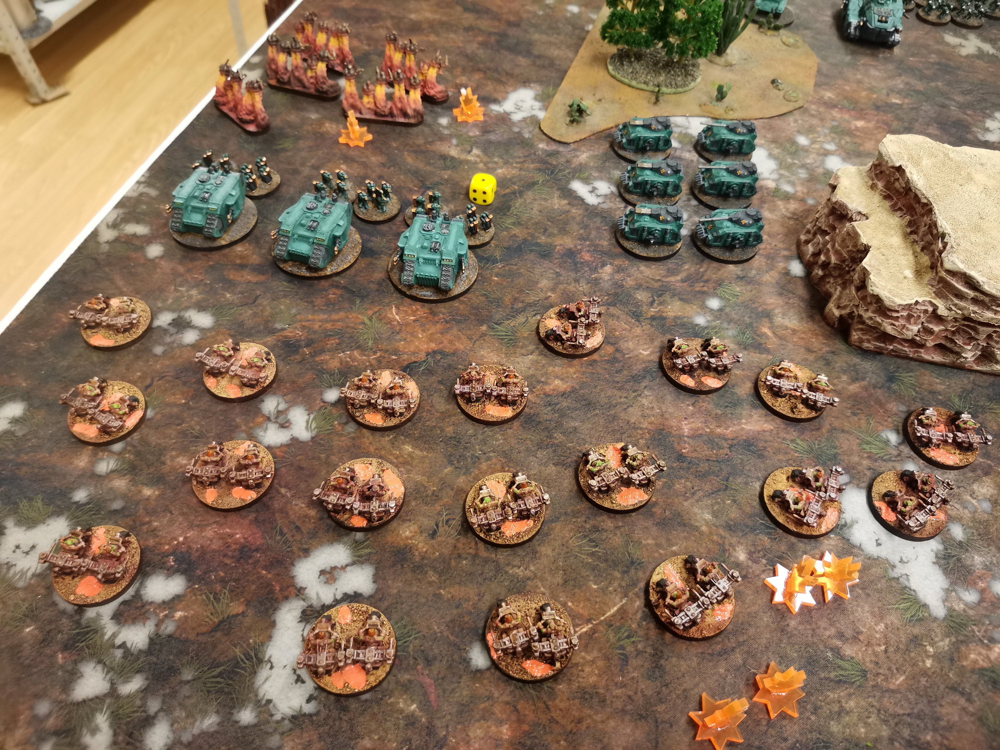
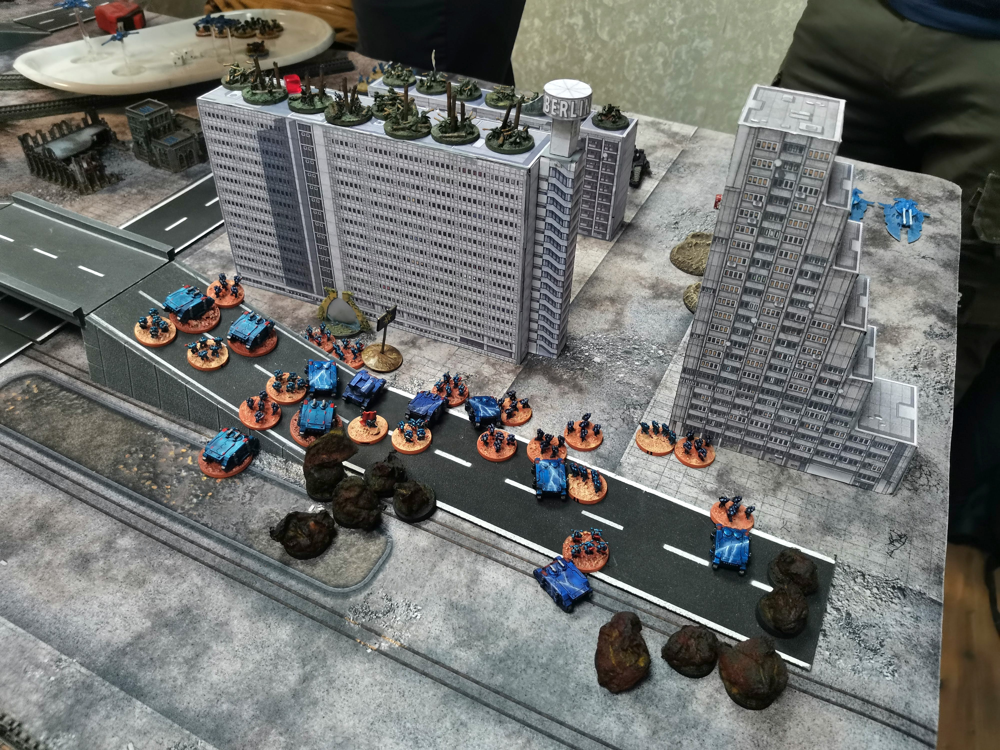
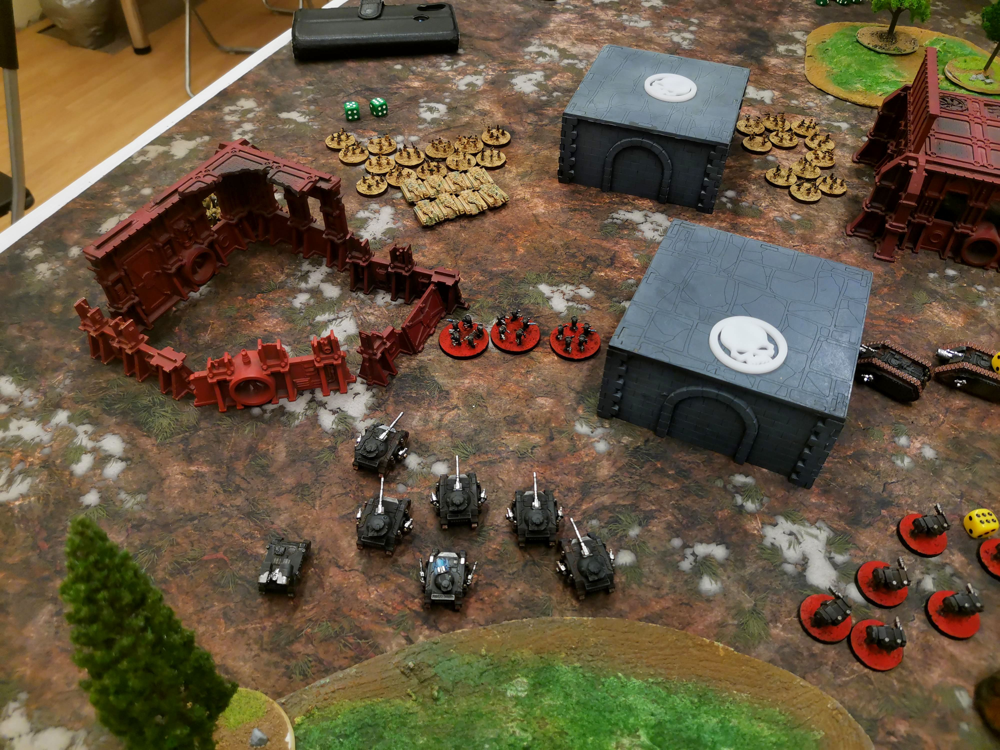
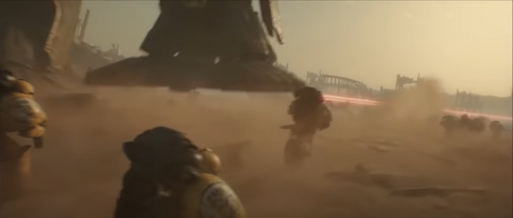

# Epic в 2022 году

Вы могли видеть синематик по Ереси Хоруса, где танки и пехота эпично наступают вместе с титанами

К сожалению, игра в Ересь обычно выглядит примерно так (парни молодцы, покрасили армии и нашли неплохой террейн)

У меня хорошие новости: есть простой способ поиграть в действительно эпичную ересь, с титанами, орбитальными атаками, массовым десантом с кораблей, авиацией и всем что мы любим. Это классическая игра от GW 2003 года Epic: Armageddon

## Правила

Правила современного эпика называются [NET Epic Armageddon](https://tp.net-armageddon.org/tournament-pack/). и отличаются от правил 2003 года только обширным факом, который описывает сложные ситуации в игре.
Существует перевод правил на русский язык, который запрещено где-либо размещать, но можно найти вк или тут неподалеку.

Есть [плейлист](https://www.youtube.com/watch?v=ynijeM3zN4k&list=PLTNi50g9CUS_IV8XCQD-L0rHmKolu4XhX), в котором на видео понятным языком (английским) пересказывают правила.

Правила отдают приятной новизной. Этот тот самый вархаммер, который мы могли бы получить, если бы ГВ могло пойти на масштабный ресет: отрядная активация, маленький даунтайм, разумное количество бросков, разные рода войск действительно разные, при этом основа правил проста и игра идет быстро - около пары часов на 3000 очков.

Есть два источника расписок:
[NET Epic Armageddon](https://tp.net-armageddon.org/)
[Французское сообщество](https://www.epicarmageddon.fr/), чей сайт сейчас лежит, так что вот ссылка на [гугл-диск](https://drive.google.com/drive/folders/18yh3-gdeoqwl-xlieu7vtu6d18ert_j7). Да, они на французском. Да, это тяжело прочитать с непривычки, но освоив правила самого эпика все становится довольно понятно.

Между собой они отличаются минимально, на уровне цены опций, но во французском варианте есть листы для маринов, титанов, механиков и рыцарей 30к, поэтому берем и остальные листы у них тоже.

Поиграв по этим листам, я хочу сказать, что они очень хорошо продуманы и протестированы, включая маринский лист на 30к. Нет как маст-хев выборов, так и бесполезных.

Основные форматы игры это 3000 и 4000 на обычном ваховском столе 120х180. На 2000 уже можно интересно играть на весь стол.

## Армии

Играть можно как в 30к, так и в 40к, причем для некоторых армий (орки, эльдары) листы на 30к и 40к ничем не отличаются. Сейчас популярнее эра 30к.
Если вам не супер принципиален бек, формат армий и баланс не отличается: система позволяет играть 30к против 40к

Список армий, доступных в этой эпохе:
Legio Astartes (все 18 штук, отличия есть, но они косметические), Legio Titanicus, Knights, Adeptus Mechanicus, Imperial Militia, Solar Auxilia, Orks (normal, feral, speed freaks), Eldar (все основные искуственные миры), Necrons

В 40к к ним добавляются:
Imperial Guard (Armageddon, Catachan, Minerva, Baran, Krieg, Cadia, Elysia),Chaos Space Marines, T'au, Tyranids, Sisters of Battle, Dark Eldar.

Как видите, это примерно тот вархаммер, который мы помним с 2003 года: все основные армии есть, но примарисов и скватов еще нет.

## Модели

Оригинальный эпик использовал масштаб 6мм. С выходом Adeptus Titanicus все плавно перешли на 8мм, которые он использует.

Основной способ получения моделей это 3д-печать.
Вот [архив STL файлов](https://disk.yandex.ru/d/kPdlhARvPSuX6A), которые я собрал. Он не полный, но мы можете его наполнить и облегчить жизнь товарищам по хобби. Есть достаточно моделей, чтобы легко собрать имперскую гвардию\милицию, спейс маринов, орков и механиков.

Модели для эпика идеальная цель для печати на 3д-принтере: мелкие, малый расход смолы, много квадратной техники. Стартовую армию десанта для ереси на 3000 очков можно напечатать за Х рублей

Сами модели можно искать на сайтах [My Mini Factory](https://www.myminifactory.com/), [Cults 3d](https://cults3d.com/) , [Gumroad](https://gumroad.com/). Сложность в том, что вы ничего найдете по запросам Space Marine, Tau, Necrons и другим торговым маркам GW. Нужно быть хитрее и искать что-то вроде Galactic Crusaders, Space Communists и Space Undead.

Проверенные печатники для эпика, у которых так же есть и свои архивы моделей
[Раз](https://vk.com/id497153129) [Два](https://vk.com/id401462367) [Три](https://vk.com/nthprints) [Четыре](https://vk.com/nathillien)

Есть [уважаемый человек](https://vk.com/im?sel=80785289), который льет технику маринов и продает на [СРМ](https://minifreemarket.com/p/23838). Я покупал, качество хорошее, делает быстро, и можно так же убедить сделать пехоту. Отличный вариант, если ваша армия марины.

Помните, что для армии нужны будут подставки. Для пехоты хорошо подходят круглые подставки от 25 до 32мм, технику можно использовать без подставок. Подставки любой формы и размера можно нарезать [тут](https://vk.com/terracutter)

## Легкий старт

Самая простая и дешевая армия для сборки это космодесант. Вот пример расписки на 3000 очков, которая познакомит вас со всеми особенностями игры и позволит легко вкатиться в хобби. Подходит для любого легиона 30к:

- Tactical 8 + Praetor + Hyperios + Rhinos 4

- Tactical 8 + Rhinos 4

- Terminators 6 + Teleport

- Cerbers 3

- Xiphon Interceptors 2

- Land Raiders 6

- Contemptors 6

Несколько советов по сбору армии:

- Две базы пехоты влезают в одну рину
- 5 маринов на базе, 25мм база для тактичек, 32 для терминаторов
- Терминаторы с Reaper Autocannon на каждые 5 человек
- для варитивности закупите по паре копий каждого героя: лорд-коммандер, капеллан, чемпион, коммандер - это дешево в рублях, но дает большую вариативность
- не забудьте ПВО
- если захотите дроп-поды, достаточно одного на всю формацию
- Ленд-рейдеры можно брать как транспорт или отдельно
- Если будете брать особое вооружение для тактичек, берите огнеметы и ракетницы в рассчете 4 на базу, и от 2 до 4 баз на отряд, и не забудьте дополнительные рины

Если вы хотите выбрать менее распространенную армию, возможно, придется брать больше моделей и больше искать информации самостоятельно

## Покраска

Красить мелкий масштаб НАМНОГО проще, чем большой. Для спейс-маринов достаточно сочетания драйбраша и проливки, никто не будет пристально рассматривать цвет линз на ваших десантниках. Если выберите выигрышную цветовую схему (тут за нас подумало GW) и красиво оформите базу, армия будет выглядеть шикарно при минимальных вложениях сил.

## Клубы

Террейн для эпика не менее чем для одного стола в Москве есть в клубах [Мантикора](https://vk.com/kni_manticore), [Портал](https://vk.com/portalmoscow), [Штандарт](https://vk.com/shtandart_club) и [Неофит](https://vk.com/clubneofit)

Московская [группа](https://vk.com/wargame6mm) с чатом договариваться играть
